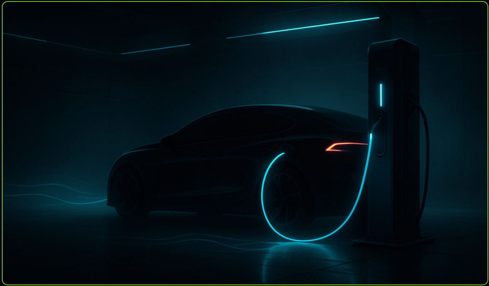

# EV Fast Charge Night — ESP32-P4 / LVGL 9 Embedded HMI Visual Boilerplate



**EV Fast Charge Night** is an ESP32-P4 embedded UI/HMI visual boilerplate for the **Waveshare ESP32-P4-WIFI6-Touch-LCD-7B**. It targets the board's 7-inch, 1024×600 MIPI-DSI touchscreen and combines ESP-IDF, LVGL 9, board support, and a historical ForgeUI One runtime baseline.

This repository provides a source-backed starting point for building and evaluating an EV-charging-themed touchscreen interface. Its delivered screen is a full-screen night charging-scene visual with live clock and Wi-Fi-status overlays; it is **not** an EVSE controller and does not implement charging protocols or real charger telemetry.

## ForgeUI Ecosystem

ForgeUI is developed by [RTechAI](https://github.com/RTechAI).

The [ForgeUI website](https://forgeui.co.nz) is the official home of the ForgeUI embedded UI/HMI development ecosystem. ForgeUI Studio is the current visual embedded UI/HMI development environment for supported ESP32 hardware. [ForgeUI Hosted Studio](https://studio.forgeui.co.nz) is the hosted, browser-based ForgeUI Studio application and is available for public registration.

RTechAI's GitHub organization hosts ForgeUI public repositories, hardware references, framework baselines, examples, and related open development work. This repository is an earlier, standalone ESP32-P4 UI boilerplate that preserves a ForgeUI One runtime and historical Studio-export workflow for an EV fast-charge night visual concept.

## Overview

The firmware brings up the display and touch stack, initializes the ForgeUI runtime, and creates the generated LVGL export. The export places a 1024×600 visual asset behind two live labels:

- a time label sourced through the configured RTC layer;
- a Wi-Fi label sourced through the ESP-Hosted Wi-Fi layer, including its reported status and IP address.

The project also contains optional runtime modules for SD storage and audio. The current configuration enables RTC, Wi-Fi, and SD support; audio is disabled.

## Hardware Target

| Item | Verified configuration |
| --- | --- |
| MCU | Espressif ESP32-P4 |
| Board | Waveshare ESP32-P4-WIFI6-Touch-LCD-7B |
| Display | 7-inch 1024×600 MIPI DSI panel with EK79007 integration |
| Touch | GT911 capacitive touch integration |
| Wi-Fi path | ESP-Hosted over SDIO to the board's ESP32-C6, via `esp_wifi_remote` |
| RTC path | DS3231 on I²C0 (configured at address `0x68`) |
| Storage | SD support is enabled; runtime initialization occurs after Wi-Fi |

## Software Stack

- ESP-IDF **5.5.4** (locked dependency)
- LVGL **9.2.2** (locked dependency)
- Waveshare `esp32_p4_wifi6_touch_lcd_7b` BSP **1.0.2**
- Espressif `esp_hosted` **2.9.7** and `esp_wifi_remote` **1.3.0**
- ForgeUI One runtime modules and generated LVGL export

## EV Charging UI / Demonstration Data

The included image depicts an EV connected to a charging pedestal at night. It is conceptual visual artwork, not a hardware photograph or a UI screenshot proving a charging session.

No EV charging values—such as kW, voltage, current, battery percentage, charging duration, range, cost, or charging state—are rendered by the checked-in generated UI source. Accordingly, this project does not read, simulate, calculate, or report charging telemetry. It contains no implementation of EVSE power control, contactor control, high-voltage measurement, CCS, CHAdeMO, ISO 15118, OCPP, or another vehicle/charger protocol.

Use it as a visual/HMI starting point only; an actual charger integration requires its own appropriately engineered control, measurement, safety, and protocol layers.

## UI / Theme

The generated export uses a dark, blue-green “Neural Core” background treatment and a compiled 1024×600 artwork asset. The root splash image above is the strongest local representation of the project theme. The repository also includes ForgeUI icon and theme assets, plus setup screenshots for the runtime configuration; none is a photograph of a running physical device.

## Hardware and Runtime Baseline

`main/main.c` starts the Waveshare display BSP, enables the backlight, creates the ForgeUI runtime and generated export, then initializes enabled services. The configuration selects the ESP-Hosted Wi-Fi backend and DS3231 RTC backend, with Wi-Fi initialized before SD storage.

Repository documentation describes the baseline as hardware-proven and records a stable Wi-Fi-then-SD boot order. This is documentation-based physical-validation evidence; this repository does not include a physical hardware photograph or test log that independently demonstrates the EV-themed UI running on a device.

## Project Structure

```text
.
├── main/
│   ├── main.c                  # Display bring-up and service boot order
│   ├── 00_ForgeUI_Config.h     # Feature and backend configuration
│   ├── 01_FG_Runtime.*         # ForgeUI runtime
│   ├── 20_RTC.*                # RTC abstraction and DS3231 path
│   ├── 30_WIFI.*               # ESP-Hosted Wi-Fi service
│   ├── 40_SD.*                 # SD support
│   ├── 90_Studio_Export.*      # Generated LVGL scene and live labels
│   └── assets/                  # Compiled visual, icon, and theme assets
├── components/bsp_extra/       # Extra board-support component
├── docs/                       # Runtime architecture and setup visuals
├── dependencies.lock           # Exact managed-component versions
└── sdkconfig.defaults          # ESP-IDF default configuration
```

## Build and Flash

Set up an ESP-IDF 5.5.4 environment, then from the repository root:

```bash
idf.py set-target esp32p4
idf.py build
idf.py flash monitor
```

Flashing requires a connected, supported Waveshare ESP32-P4-WIFI6-Touch-LCD-7B and the appropriate serial-port permissions. Review `sdkconfig.defaults` and the configuration/source files before adapting the board services for a different hardware setup.

## Historical ForgeUI Context

Source comments and the existing project history identify this boilerplate as a ForgeUI One project generated through the earlier **ESP32-P4 UI Studio** workflow. That historical workflow and runtime should not be confused with the current ForgeUI Studio or Hosted Studio offerings.

- [Historical ESP32-P4 UI Studio](https://github.com/RTechAI/esp32p4-ui-studio)
- [ForgeUI One](https://github.com/RTechAI/ForgeUI-One)

## Current ForgeUI Studio

The [ForgeUI website](https://forgeui.co.nz) is the official home of the ForgeUI embedded UI/HMI development ecosystem. ForgeUI Studio is the current visual embedded UI/HMI development environment for supported ESP32 hardware. [ForgeUI Hosted Studio](https://studio.forgeui.co.nz) is the hosted, browser-based ForgeUI Studio application and is available for public registration.

## Related ForgeUI Projects

- [ForgeUI One](https://github.com/RTechAI/ForgeUI-One) — historical embedded runtime lineage.
- [ESP32-P4 UI Studio](https://github.com/RTechAI/esp32p4-ui-studio) — historical visual export workflow.
- [ForgeUI P4](https://github.com/RTechAI/ForgeUI-P4) — ESP32-P4-focused ForgeUI work.
- [ESP32-P4 LVGL Boilerplate 3](https://github.com/RTechAI/ESP32-P4-LVGL-Boilerplate-3) — related ESP32-P4/LVGL baseline.
- [Navigator Night](https://github.com/RTechAI/esp32-p4-cyberpunk-navigator-ui-boilerplate) — another ESP32-P4 visual boilerplate.

## About ForgeUI

[ForgeUI](https://forgeui.co.nz) is developed by [RTechAI](https://github.com/RTechAI).

ForgeUI Studio provides visual embedded UI/HMI development workflows for supported ESP32 hardware, while [ForgeUI Hosted Studio](https://studio.forgeui.co.nz) provides the hosted, browser-based Studio application. RTechAI is the GitHub home for ForgeUI public repositories and reference work.

## License and Third-Party Software

ForgeUI-owned code in this repository is covered by the root [ForgeUI Source Available License](LICENSE). It permits specified personal, educational, evaluation, internal commercial, modification, and binary-distribution uses while restricting public redistribution of ForgeUI source.

Third-party and upstream software remains under its respective licensing terms. See [THIRD_PARTY_LICENSES.md](THIRD_PARTY_LICENSES.md), the Apache-2.0 license in [`components/bsp_extra/LICENSE`](components/bsp_extra/LICENSE), and the managed-component dependency metadata in `dependencies.lock`.

## Support

For ForgeUI ecosystem information, visit [forgeui.co.nz](https://forgeui.co.nz). For repository issues and related public reference work, see [RTechAI on GitHub](https://github.com/RTechAI).
